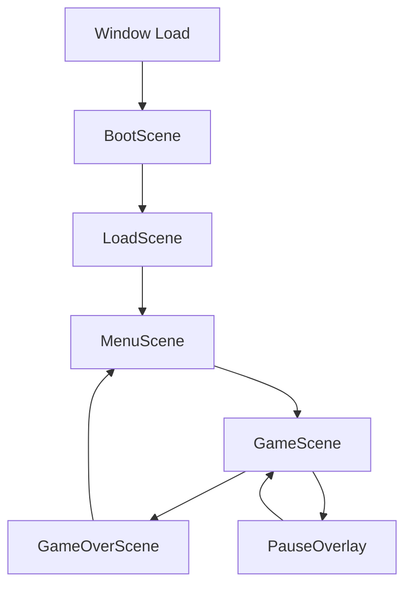

# Implementation Spec: Crystal Runner 3D

## 1. File Map

```
src/main.js                     # Entry point, initializes Game class and handles window events
src/core/Game.js               # Main game controller, manages all systems and scene transitions
src/core/SceneManager.js       # Handles scene switching and lifecycle management
src/core/StateManager.js       # FSM implementation for game states
src/core/AssetManager.js       # Loads and caches 3D geometries, textures, and audio buffers
src/entities/Player.js         # Player spacecraft with movement, animation, and collision bounds
src/entities/Tunnel.js         # Infinite tunnel generation with procedural segments
src/entities/Crystal.js        # Collectible gems with rotation animation and scoring logic
src/entities/Obstacle.js       # Moving barriers with collision detection and destruction effects
src/systems/InputSystem.js    # Unified input handling for keyboard, mouse, and touch
src/systems/AudioSystem.js    # 3D positional audio with Web Audio API synthesis
src/systems/ParticleSystem.js # GPU-based particle effects for crystals, explosions, trails
src/systems/CollisionSystem.js # AABB and sphere collision detection with spatial partitioning
src/scenes/BootScene.js        # Initial scene that checks WebGL support and loads core assets
src/scenes/LoadScene.js        # Loading screen with progress bar and asset preloading
src/scenes/MenuScene.js        # Main menu with play button and high score display
src/scenes/GameScene.js        # Active gameplay scene with HUD and game loop
src/scenes/GameOverScene.js    # End screen with final score and restart option
```

## 2. Scene Lifecycle



**Transitions:**
- **Boot → Load**: WebGL check passes, call `CrazySDK.init()`
- **Load → Menu**: All assets loaded (100%), setup complete
- **Menu → Game**: Play button clicked, call `CrazySDK.gameplayStart()`
- **Game → GameOver**: Player collision detected, call `CrazySDK.gameplayStop()`
- **Game → Pause**: ESC/Pause pressed, call `CrazySDK.gameplayStop()`
- **Pause → Game**: Resume clicked, call `CrazySDK.gameplayStart()`
- **GameOver → Menu**: Restart button clicked

## 3. Entities & Classes

### Game
```javascript
class Game {
  constructor()
  sceneManager: SceneManager
  stateManager: StateManager
  assetManager: AssetManager
  currentScene: Scene
  
  init()
  update(deltaTime)
  render()
  resize(width, height)
  destroy()
}
```

### Player
```javascript
class Player extends THREE.Group {
  constructor(scene)
  mesh: THREE.Mesh
  position: THREE.Vector3
  velocity: THREE.Vector3
  bounds: THREE.Box3
  
  update(deltaTime, input)
  move(direction)
  getCollisionBounds()
  playDeathAnimation()
}
```

### Tunnel
```javascript
class Tunnel {
  constructor(scene)
  segments: TunnelSegment[]
  segmentLength: 100
  segmentWidth: 50
  
  update(playerZ)
  generateSegment(index)
  removeOldSegments()
  getWallCollisions(playerBounds)
}
```

### Crystal
```javascript
class Crystal extends THREE.Group {
  constructor(position, type)
  mesh: THREE.Mesh
  rotationSpeed: number
  value: number
  collected: boolean
  
  update(deltaTime)
  collect()
  playCollectEffect()
}
```

### Obstacle
```javascript
class Obstacle extends THREE.Group {
  constructor(